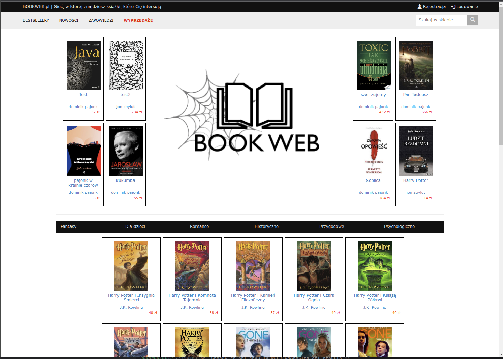

# 👶🏽 Bookweb - School Project (2017)

## Description
This project was developed for a school project in 2017. It is a simple web application that allows users to search for books and add them to their personal library. The application allows to search for books and retrieve information about them.

## Technologies
This project was developed using Python

---

*This project is published solely for archival purposes.*
